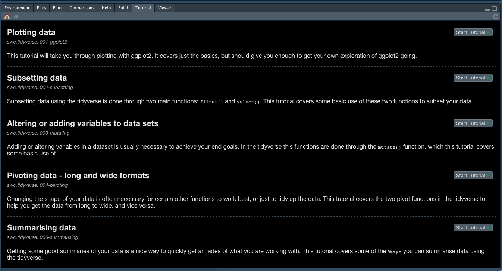

## Recommended setup
This workshop is a combination of presentation, live coding and exercises. 
If you are attending it as a webinar, having a dual monitor set-up is recommended. 
This would enable you to follow the live coding, by also typing in the commands and experience the effects you self.
Programming is a skill where you learn best by doing.

That being said, as there are also exercises, so you can also follow using a single monitor. 

## Install R
Make sure to have R installed on your computer.
It is recommended that you have a newer version of R installed, and it must be newer than version **4.0.0**.
Download R from [the R-project](https://www.r-project.org/)
If you attend the course with an older R version than this, you cannot expect the results of your code to be the same as the other participants and the instructors.

#### Windows computers
The tidyverse packages require [rtools](https://cran.r-project.org/bin/windows/Rtools/) to be installed. 
Make sure to have the required version installed before proceeding.

## Install RStudio

The best experience with the workshop is to have an RStudio newer than 1.3. 
It is not necessary, but highly recommended.

[RStudio downloads page](https://rstudio.com/products/rstudio/download/#download)


## Install course materials

This package contains materials that are necessary for the workshop. 

You can install swc.tidyverse from [github](https://github.com/Athanasiamo/swc.tidyverse), which will also install the packages that the tutorial will cover. To install the package, open your RStudio installed before, and copy these two lines into the tab called "Console". If you have a newly installed RStudio, this should be the tab on the left once RStudio is opened.

```r
install.packages("remotes")
remotes::install_github("Athanasiamo/swc.tidyverse")
```

If the console fills up with a numbered list with names of packages and has the question:
```
Enter one or more numbers, or an empty line to skip updates: 
```

Please enter `1` . This will update all your packages (since you have them installed), to make sure you are working on the same version of packages as the remaining participants.
This might occur several times, please enter `1` each time.

### Loading the package
Loading the package will also load the necessary libraries directly
```r
library(swc.tidyverse)
```

Additionally, there are exercises connected to each of the topics which will also be accessible via the [learnr](https://rstudio.github.io/learnr/)-package. You can either see the list of packages with the below code:

```r
learnr::available_tutorials("swc.tidyverse")
```

```
Available tutorials:
* swc.tidyverse
  - 001-ggplot2     : "Plotting data"
  - 002-subsetting  : "Subsetting data"
  - 003-mutating    : "Altering or adding variables to data sets"
  - 004-pivoting    : "Pivoting data - long and wide formats"
  - 005-summarising : "Summarising data"
  - 006-combining   : "Combining all the Tidyverse" 
```

or find them in your RStudio "Tutorials" pane.



### If install fails
If the package install fails, you can try installing everything individually and then the package from source.
Start by installing the dependent packages for the course:

```r
install.packages(c("tidyverse", "palmerpenguins", "learnr", "remotes"), Ncpus = 2)
remotes::install_github("rstudio-education/gradethis")
``` 

When these are successful, you should be able to install the course package.
Download the newest tar-version from the [source](https://github.com/Athanasiamo/swc.tidyverse/blob/main/source/) directory, make sure you know where it has downloaded to and install by opening RStudio and pasting the below code into the R console.

```r
# Alter the /path/to section to the path where the downloaded file is. 
install.packages("/path/to/swc.tidyverse_0.0.01.tar.gz", repos = NULL)
```

If you are still struggling to install the package, please create [a ticket](https://github.com/Athanasiamo/swc.tidyverse/issues) pasting the command and output you get so I can help you get it sorted.
We will also be hosting a 1 hour guided install session from **11-12am** on **Friday 21at of May**. Please join this session for more "hands-on" direct help in getting you up to speed.

### If you are on a MacBook with the M1 chip.
The M1-processor for new MacBooks, it all its glory, does not run RStudio. We cannot control this. If you have a MacBook with the M1-chip let us know via e-mail, and we will create a learning environment for you in RStudio cloud. 
